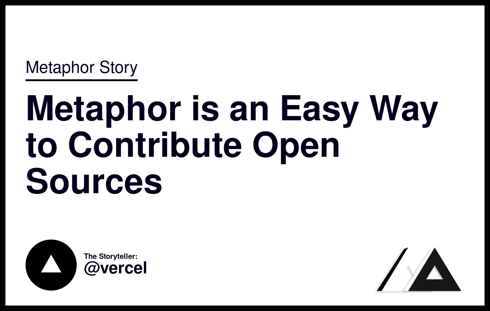

<p align="center">
    
    <h1 align="center">Create Banner Image - Github Action & Rest API</h1>
    <p align="center">An easy way to make banners from articles that you make with only 1 step!</p>
</p>

## Github Action Usage
```yaml
on: workflow_dispatch

jobs:
    create_banner_image:
        name: "Create Banner Image"
        runs-on: ubuntu-latest
        steps:
            - uses: actions/checkout@main
            - uses: darkterminal/create-banner-image@master # Uses an action in the root directory
              with:
                github-token: ${{ secrets.GITHUB_TOKEN }}
                canonical-name: 'create-banner-image-from-grithub-action'
                gradient-colors: '#fc00ff,#00dbde'
                article-name: 'Create Banner Image From Github Action'
                article-category: 'open-source'
                emoji: '🎉'
```

## REST API Usage (Deploy on your server)
### Legacy Generator
- endpoint: `/generator`
- method: `POST`
- fields:
  - `canonicalName` slug string
  - `articleName` article name / title
  - `gradientColors` array of strings
  - `articleCategory` article category
  - `emoji` string

**Example**
```curl
curl -X POST \
  'https://<base-url>/generator' \
  --header 'Accept: */*' \
  --header 'Content-Type: application/json' \
  --data-raw '{
  "canonicalName": "metaphor-website-live",
  "articleName": "Metaphor Website Live",
  "gradientColors": ["#fc00ff","#00dbde"],
  "articleCategory": "open-sorce",
  "emoji": "🎉"
}'
```
**Retult**:


### Classic SEO Banner
- endpoint: `/classic-seo-banner`
- method: `GET`
- query:
  - `articleName` article name / title
  - `author` The author name
  - `language` Type of programming language

**Retult**:


### Modern SEO Banner
- endpoint: `/seo-banner`
- method: `GET`
- query:
  - `title` article name / title
  - `author` The author name
  - `logo` web logo URL
  - `head` default "Metaphor Story"
  - `writer` writer github username

**Retult**:

